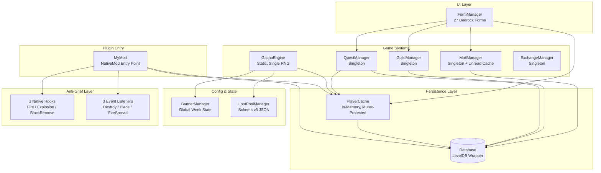

<div align="center">

# 🌌 Aetheria Server Mod

**A comprehensive Minecraft Bedrock Server modification featuring Quest, Currency, Gacha, Guild, and Mail systems — built with C++17 on the LeviLamina framework.**

[](https://en.cppreference.com/w/cpp/17)
[](https://github.com/LiteLDev/LeviLamina)
[](https://www.minecraft.net/en-us/download/server/bedrock)
[](https://xmake.io)
[](LICENSE)
[]()

</div>

---

## 📖 Table of Contents

- [About](#-about)
- [Key Features](#-key-features)
- [Screenshots](#-screenshots)
- [Architecture Overview](#-architecture-overview)
- [Gacha Mathematics](#-gacha-mathematics)
- [Installation](#-installation)
- [Configuration](#-configuration)
- [In-Game Guide](#-in-game-guide)
- [Commands Reference](#-commands-reference)
- [Project Structure](#-project-structure)
- [Database Schema](#-database-schema)
- [Event Listeners & Native Hooks](#-event-listeners--native-hooks)
- [Development](#-development)
- [Roadmap](#-roadmap)
- [Authors](#-authors)
- [Acknowledgments](#-acknowledgments)
- [License](#-license)

---

## 🎯 About

**Aetheria Server Mod** is a server-side C++ plugin that transforms a vanilla Minecraft Bedrock Dedicated Server into a feature-rich progression experience inspired by gacha-style games like Genshin Impact. It introduces persistent player progression, virtual economy, randomized rewards with fair pity mechanics, social guild structures, asynchronous in-game messaging, and robust anti-griefing for key buildings — all running natively on the server with no client-side mod required.

The project is developed as a final assignment for the **Data Structures** course at Universitas Muhammadiyah Prof. Dr. Hamka (UHAMKA), Faculty of Engineering, Informatics Engineering Program. It demonstrates real-world application of hash maps, key-value stores, event-driven architecture, and probabilistic algorithms in a complex, multi-system C++ codebase.

### Why This Project?

Most server-side Bedrock mods focus on a single feature. Aetheria integrates **five interlocking systems** sharing one persistence layer and one in-memory cache, demonstrating how a clean architectural foundation — singletons, partial database updates, thread-local RNG, and event-driven design — scales to complex domain logic without sacrificing performance.

---

## ✨ Key Features

### 🎰 Gacha System
- **3-tier rarity** (B5 Legendary, B4 Epic, B3 Rare) with mathematically-sound rate distribution
- **Exponential pity curve** ensuring B5 by pull 70, B4 by pull 20
- **40/60 hidden rate** mechanic with **Dynamic Guarantee Window** (recover from losses within 30 pulls)
- **Dynamic Priority Single RNG** — total probability always sums to exactly 100% in all conditions
- **4-week banner rotation** — Weapons, Armor, Ranged & Utility, Tools
- **Independent pity counters** for B5 and B4 running in parallel

### 📜 Quest System
- **4 quest tiers**: Normal (100% chance), Advance (35%), Special (7%), Monthly
- **Two categories**: Kill (monsters) and Collect (items)
- **Multi-layer kill tracking** with TTL fallback for indirect kills (fire, drowning, fall damage)
- **Auto-reset** at 00:00 server time daily, 1st of month for monthly
- **JSON-driven** quest pools — easily extensible without recompiling

### 💰 Currency System
- **Three-tier currency**: Diamond → SheldDust → Zen Ingot
- **Bulk exchange** options: x1, x10, x100 multipliers
- **Configurable rates** via `exchange_config.json`
- **Direct integration** with `PlayerProfile` — atomic, partial DB writes

### 🛡️ Guild System
- **4-member guilds** with democratic governance
- **Kick Vote** & **Mutiny Vote** — unanimous approval required, 1-hour timeout, 10 ZI fee
- **Multi-layer Friendly-Fire Protection** (melee + projectile + splash potions)
- **Guild emblems** — 12 Unicode presets that render reliably in Bedrock font
- **Rename system** with cost (15 ZI) and cooldown (14 days)
- **Activity log** with relative time formatting
- **Last-seen tracking** with batched I/O to minimize disk writes

### 📬 Mail System
- **Persistent inbox** stored in LevelDB — survives offline periods
- **6 mail types**: System, GuildInvite, KickVote, MutinyVote, GuildNotice, GuildJoinRequest
- **V2 indexed format** with cached unread count (avoids N+1 query)
- **FIFO eviction** at 100 mails per player
- **30-day retention** with automatic purge

### 🏛️ World Structures
- **Adventure Guild** — auto-spawns 100% in birch and forest villages
- **Shrine** — auto-spawns 100% in cherry villages
- **Anti-Grief Protection** — multi-layer (3 event listeners + 3 native hooks) protects critical structures from block destruction, fire, and explosions

### 🎨 Rich UI
- **27 Bedrock Form screens** covering all interactions
- **Color-coded** chat prefixes with guild emblems
- **Real-time** vote stopwatches and unread badges

---

## 📸 Screenshots

> *Add screenshots here once available — recommended:*
> - Welcome Menu form
> - Gacha pull result with 5-star animation
> - Guild management menu
> - Quest list view
> - Inbox with unread mail

---

## 🏗️ Architecture Overview

### High-Level Component Diagram



### Component Responsibilities

| Component | Pattern | Responsibility |
|-----------|---------|----------------|
| `MyMod` | NativeMod entry | Plugin lifecycle (load/enable/disable), event registration, shrine/guild base registry |
| `Database` | Singleton | LevelDB wrapper; partial updates via `savePity()`, `saveCurrency()`, `saveQuests()` |
| `PlayerProfile` | Instance per player | In-memory state: wallet, pity, quest progress, welcome flag |
| `PlayerCache` | Thread-safe Singleton | `unordered_map<xuid, unique_ptr<PlayerProfile>>` with `std::mutex` |
| `GachaEngine` | Static class | Single-call `performPull()`: pity → rate → priority stack → roll → 40/60 → reward |
| `BannerManager` | Singleton | Global current-week state, persisted to `banner_state.json` |
| `LootPoolManager` | Singleton | Loads gacha pools (B5/B4 Rate-On per week + Standard + B3 pool) |
| `QuestManager` | Singleton | Quest generation, kill tracker (with TTL fallback), submission, auto-reset |
| `GuildManager` | Singleton | Guild CRUD, voting, FF toggle, rename, emblem, activity log |
| `MailManager` | Singleton | Mail persistence with V2 index format + unread cache |
| `ExchangeManager` | Singleton | Currency conversion option config (with bulk multipliers) |
| `FormManager` | Static aggregator | All 27 UI forms, header-only |

---

## 🔢 Gacha Mathematics

### B5 (Legendary) — Exponential Pity Curve

For the first 40 pulls, the rate is **static at 0.6%**. Starting from pull 41, the rate grows exponentially:

```
Rate_B5(pity) = 0.006 + 0.994 × ((pity − 40) / 30)⁴
```

This guarantees **100% rate at pull 70**, with a smooth curve that feels nearly flat from pulls 41–55 and ramps up dramatically toward pull 70.

#### Implementation Reference
[`src/mod/PlayerProfile.cpp::calcRateB5()`](src/mod/PlayerProfile.cpp)

```cpp
if (mPityB5 <= kSoftPityB5)  // kSoftPityB5 = 40
    return kRateB5Base;       // kRateB5Base = 0.006
double t = std::min(static_cast<double>(mPityB5 - kSoftPityB5) / 30.0, 1.0);
return std::min(kRateB5Base + 0.994 * std::pow(t, 4.0), 1.0);
```

### Dynamic Guarantee Window (Loss Pity)

When the player wins B5 but loses the 40/60 hidden rate (gets a Rate-Off item), the pity counter is **NOT reset**. Instead, the system records `LossPity` and activates a dynamic guarantee:

```
Rate_B5(pity) = 0.006 + 0.994 × ((pity − LossPity) / 30)⁴
```

This guarantees the player obtains a B5 Rate-On item **within 30 pulls** of losing — regardless of the LossPity position.

### B4 (Epic) — Sharper Exponential

B4 uses a steeper curve with exponent 5 and hard pity at 20:

```
Rate_B4(pity) = 0.051 + 0.949 × (pity / 20)⁵
```

The higher exponent keeps the rate near-flat at 5.1% for pulls 0–15, then ramps up sharply toward pull 20.

### Dynamic Priority Single RNG

To guarantee total probability always sums to 100% — even in extreme scenarios where `Rate_B5 = 93%` and `Rate_B4 = 80%` — the engine uses **Dynamic Priority Stacking** with a single RNG roll:

```cpp
bool isB5First = (Rate_B5 >= Rate_B4);
if (isB5First) {
    eff5 = Rate_B5;
    eff4 = min(Rate_B4, max(0, 100 - Rate_B5));
    eff3 = max(0, 100 - eff5 - eff4);
} else {
    eff4 = Rate_B4;
    eff5 = min(Rate_B5, max(0, 100 - Rate_B4));
    eff3 = max(0, 100 - eff4 - eff5);
}
float roll = uniform_real_distribution<float>(0.0f, 100.0f)(rng);
```

This ensures no probability mass is ever "lost" or double-counted, even when rates overlap heavily near hard pity.

### Constants Summary

| Constant | Value | Meaning |
|----------|-------|---------|
| `kRateB5Base` | `0.006` (0.6%) | Base B5 rate |
| `kSoftPityB5` | `40` | Pity threshold where exponential growth starts for B5 |
| `kRateB4Base` | `0.051` (5.1%) | Base B4 rate |
| `kHardPityB4` | `20` | Hard pity for B4 |
| `kGuaranteeAdd` | `30` | Pulls added after loss for guarantee window |
| `kDiaToSD` | `10` | Diamond → SheldDust ratio |
| `kSDtoZI` | `10` | SheldDust → Zen Ingot ratio |

---

## 🛠️ Installation

### Prerequisites

- **Minecraft Bedrock Dedicated Server** v1.21.x (Windows)
- **LeviLamina** framework installed on the BDS
- **xmake** build tool (Lua-based, cross-platform)
- **C++17-capable compiler** (MSVC 2022 recommended on Windows)
- **Git** for cloning

### Building from Source

```bash
# Clone the repository
git clone https://github.com/<your-username>/aetheria-server-mod.git
cd aetheria-server-mod

# Build with xmake (release config)
xmake f -m release
xmake build

# Output: build/windows/x64/release/gacha_mod.dll
```

### Installing the Compiled Plugin

1. Copy `gacha_mod.dll` to your BDS at:
   ```
   <BDS-root>/plugins/gacha_mod/gacha_mod.dll
   ```

2. Create the data directory:
   ```
   <BDS-root>/plugins/gacha_mod/data/
   ```

3. Copy the configuration files (`gacha_pool.json`, `quest_config.json`) into the data folder. The plugin will auto-generate `banner_state.json` and `exchange_config.json` on first run if missing.

4. (Optional) Install the **Behavior Pack** for custom NPC entities (Adventure Guild Receptionist & Shrine Maiden) at:
   ```
   <BDS-root>/development_behavior_packs/aetheria_bp/
   ```

5. Start the server. You should see:
   ```
   [GachaMod] Database OK: <path>
   [GachaMod] Quest config OK.
   [GachaMod] Exchange config OK: 4 options loaded.
   [BannerManager] Banner aktif: Week 1 — Blade of Nether
   GachaMod enabled.
   ```

---

## ⚙️ Configuration

The mod uses **four JSON configuration files** located in the plugin's data directory.

### `gacha_pool.json` (Schema v3)

Defines all gacha loot pools across the 4-week banner rotation.

<details>
<summary><strong>Example item entry</strong></summary>

```json
{
  "item_id": "minecraft:netherite_sword",
  "name": "Netherite Sword [Sharpness X]",
  "display_name": "§6⚔ §lBlade of Aether §r§c[Sharpness X]",
  "count": 1,
  "weight": 1,
  "enchantments": [
    { "id": "minecraft:sharpness", "level": 10 }
  ]
}
```
</details>

**Top-level keys:**
- `_schema_version`: Currently `3`
- `b5_rate_on`: `{week → [PoolItem]}` for B5 banner items
- `b4_rate_on`: `{week → [PoolItem]}` for B4 banner items
- `b5_standard`, `b4_standard`, `b3_pool`: Universal standard pools
- `banner_info`: Display info per week (name, theme, featured item list)

### `quest_config.json`

```json
{
  "normal_pool":  [ /* 9 quest definitions */ ],
  "advance_pool": [ /* 7 quest definitions */ ],
  "special_pool": [ /* 2 quest definitions */ ],
  "monthly_pool": [ /* 2 quest definitions */ ],
  "generation_rules": {
    "normal_count": 2,
    "advance_chance": 0.35,
    "special_chance": 0.07
  }
}
```

### `exchange_config.json`

Auto-generated on first run with default options. Customize to add new conversion rates or bulk multipliers.

```json
{
  "exchanges": [
    { "id": "diamond_to_sd",  "from_currency": "diamond", "from_amount": 10, "to_currency": "sd", "to_amount": 1, "bulk_multiplier": 1 },
    { "id": "sd_to_zi_x10",   "from_currency": "sd",      "from_amount": 10, "to_currency": "zi", "to_amount": 1, "bulk_multiplier": 10 }
  ]
}
```

### `banner_state.json`

Auto-managed by `BannerManager`. Stores the currently active banner week (1–4). Modified via the `/gachaadmin setweek <n>` command.

```json
{
  "current_week": 1
}
```

---

## 🎮 In-Game Guide

### For Players

| Action | How To |
|--------|--------|
| Open Account menu | `/account` |
| Open Guild menu | `/guild` |
| Buy a Gacha pull | Visit **Shrine** → talk to Shrine Maiden → Gacha menu |
| Convert currency | Visit **Shrine** → Currency Exchange |
| Accept a daily quest | Visit **Adventure Guild** → left-click the Receptionist NPC |
| Submit a collect quest | At Quest Menu, select active Collect quest → Submit |
| Check inbox | `/account` → Inbox |

### Currency Conversion Rates

```
10 Diamond  ──►  1 SheldDust
10 SheldDust ──►  1 Zen Ingot
 1 Zen Ingot  ──►  1 Gacha Pull
10 Zen Ingot  ──►  10 Pulls + 1 Free Bonus
```

### Quest Reward Summary

| Tier | Reward | Spawn Chance | Daily Limit |
|------|--------|--------------|-------------|
| ⭐ Normal | 15 SheldDust | 100% | 2 quests |
| ⭐⭐ Advance | 25 SheldDust | 35% | ≤1 quest |
| ⭐⭐⭐ Special | 40 SheldDust | 7% | ≤1 quest |
| 🌙 Monthly | 10 Zen Ingot | 100% | 1/month |

### Gacha Rates

| Tier | Base Rate | Hard Pity | Mechanic |
|------|-----------|-----------|----------|
| ⭐⭐⭐⭐⭐ B5 | 0.6% | Pull 70 | 40/60 hidden + Dynamic Window |
| ⭐⭐⭐⭐ B4 | 5.1% | Pull 20 | 40/60 + Guaranteed-next |
| ⭐⭐⭐ B3 | ~94% | — | Filler |

### Banner Rotation (4-Week Cycle)

| Week | Banner | Theme |
|------|--------|-------|
| 1 | **Blade of Nether** | Netherite Swords with enchantments |
| 2 | **Warden's Bastion** | Full Netherite Armor sets |
| 3 | **Hunter's Arsenal** | Bow, Crossbow, Trident |
| 4 | **Tool Grandmaster** | Netherite Tools + Fishing Rod |

---

## ⌨️ Commands Reference

### Player Commands

| Command | Description |
|---------|-------------|
| `/account` | Open the Account window (wallet, pity status, inbox) |
| `/guild` | Open the Guild menu (create / request join / manage) |

### Admin Commands (`GameDirectors` permission)

<details>
<summary><strong>Currency & Pity Management</strong></summary>

```
/gachaadmin add <xuid> <type> <amount>          # Add SD or ZI to a player
/gachaadmin pity_set <tier> <xuid> <value>      # Set pity counter manually
/gachaadmin pity_reset_global                   # Reset pity for all players (use carefully!)
```
</details>

<details>
<summary><strong>Database Inspection</strong></summary>

```
/gachaadmin db_dump                             # Dump all keys (use for diagnostics)
/gachaadmin db_reload                           # Reload config files without restart
/gachaadmin db_player_info <xuid>               # Inspect a specific player's data
```
</details>

<details>
<summary><strong>Structure Registration</strong></summary>

```
/gachaadmin register_altar                      # Register the block this command runs on as Shrine
/gachaadmin register_guildbase                  # Register as Adventure Guild base
/gachaadmin unregister_altar                    # Remove registration at current position
/gachaadmin unregister_guildbase
```

> These are typically auto-fired by hidden command blocks under the structures every 100 ticks.
</details>

<details>
<summary><strong>Banner & Loot Pool</strong></summary>

```
/gachaadmin setweek <1-4>                       # Manually change active banner week
/gachaadmin get all loot pool b5 week <n>       # List B5 Rate-On items for a week
/gachaadmin get all loot pool b4 week <n>       # List B4 Rate-On items
/gachaadmin get all loot pool b5 std            # B5 Standard pool
/gachaadmin get all loot pool b4 std            # B4 Standard pool
/gachaadmin get all loot pool b3                # B3 pool
```
</details>

<details>
<summary><strong>Gacha & Quest Debug</strong></summary>

```
/gachaadmin gacha start <xuid> <count>          # Force a gacha pull (debug)
/gachaadmin quest reset_daily                   # Reset all players' daily quests
/gachaadmin quest reset_monthly                 # Reset monthly quests
/gachaadmin quest list                          # Show all quest definitions
/gachaadmin quest kill <mob_id> <count>         # Simulate kills for testing
```
</details>

---

## 📁 Project Structure

```
aetheria-server-mod/
├── src/
│   └── mod/
│       ├── MyMod.cpp / MyMod.h              # Plugin entry, event registration
│       ├── Database.cpp / Database.h        # LevelDB wrapper with partial updates
│       ├── PlayerProfile.cpp / .h           # Per-player state + PlayerCache
│       ├── GachaEngine.cpp / .h             # Pull execution (static class)
│       ├── GachaTypes.h                     # Enums & structs (Tier, RateType, etc.)
│       ├── BannerManager.cpp / .h           # Global banner week state
│       ├── LootPoolManager.cpp / .h         # Pool parsing & item selection
│       ├── QuestManager.cpp / .h            # Quest generation, kill tracker, reset
│       ├── QuestData.h
│       ├── GuildManager.cpp / .h            # Guild CRUD + voting (1192 lines)
│       ├── GuildData.h                      # GuildData, KickVote, MutinyVote, Mail
│       ├── MailManager.cpp / .h             # Mailbox persistence + unread cache
│       ├── ExchangeManager.cpp / .h         # Currency exchange config
│       ├── DebugCommand.cpp / .h            # Admin command registration
│       ├── FormManager.h                    # 27 Bedrock UI forms (header-only)
│       ├── FireBurnHook.cpp                 # Native hook: prevent fire spread
│       ├── ExplosionHook.cpp                # Native hook: prevent block-breaking explosions
│       ├── BlockRemoveHook.cpp              # Native hook: catch wither destruction
│       ├── MemoryOperators.cpp              # Custom memory operators
│       ├── gacha_pool.json                  # Loot pool config (schema v3)
│       └── quest_config.json                # Quest pool definitions
├── xmake.lua                                # Build configuration
└── README.md
```

**Source statistics:**
- **34 files**, **~540 KB** total
- **C++17** with modern features (`<format>`, structured bindings, `if constexpr`)
- **Zero macros** beyond `LL_AUTO_TYPE_INSTANCE_HOOK` (LeviLamina's hook macro)

---

## 🗄️ Database Schema

All persistent data is stored in a **single LevelDB instance** in the plugin's data directory. The schema uses **prefixed keys** to separate domains — a standard idiom in key-value stores since LevelDB stores keys in lexicographic order, making prefix scans efficient.

| Key Format | Value | Description |
|------------|-------|-------------|
| `player:{xuid}` | `PlayerData` JSON | Pity counters, wallet, quest progress, banner week |
| `guild:{guildId}` | `GuildData` JSON | Leader, members, log, FF protection, emblem |
| `guild_by_member:{xuid}` | `guildId` string | Reverse lookup (one player → one guild) |
| `guild_kick:{guildId}` | `KickVote` JSON | Active kick vote (max 1 per guild) |
| `guild_mutiny:{guildId}` | `MutinyVote` JSON | Active mutiny vote (max 1 per guild) |
| `mail:{xuid}:{mailId}` | `MailMessage` JSON | Individual mail entry |
| `mail_index:{xuid}` | V2 Index JSON | Array of mailIds (newest first) + unread count |

### Partial Update Methods

To minimize I/O, `Database` provides field-specific update methods rather than always rewriting the full `PlayerData` blob:

```cpp
db.savePity(xuid, pityB5, guaranteeWindowB5, guaranteedFlagB5, pityB4, guaranteedFlagB4);
db.saveCurrency(xuid, sheldDust, zenIngot);
db.saveQuests(xuid, dailyJson, monthlyJson, lastReset, lastMonthlyReset);
```

These are called from `PlayerProfile::flushPity()`, `flushCurrency()`, and after quest mutations — avoiding full struct re-serialization on every minor state change.

---

## 🎧 Event Listeners & Native Hooks

### Event Listeners (11 total)

Registered in `MyMod::enable()` against `ll::event::EventBus`:

| Event | Purpose |
|-------|---------|
| `PlayerJoinEvent` | Hybrid sync+deferred profile load, welcome popup, unread mail badge |
| `PlayerDisconnectEvent` | Flush profile to DB, update guild last-seen |
| `ServerLevelTickEvent` | Vote expiry, mail purge, batched last-seen flush |
| `PlayerDestroyBlockEvent` | Anti-grief (block destroy in protected zones) |
| `PlayerPlacingBlockEvent` | Anti-grief (block placement) |
| `FireSpreadEvent` | Anti-grief (fire spread) |
| `PlayerInteractBlockEvent` | Form UI trigger from special command blocks |
| `PlayerAttackEvent` | FF protection (melee) + NPC Receptionist left-click |
| `ActorHurtEvent` | FF protection (projectile) with shooter resolution |
| `MobDieEvent` | Quest kill tracking + hit-tracker fallback |
| `PlayerChatEvent` | Guild prefix injection `§6[♛ Aetheria]` |

### Native Function Hooks (3 total)

For events not exposed via LeviLamina's event bus, raw function hooks are used:

| Hook File | Target Function | Purpose |
|-----------|-----------------|---------|
| `FireBurnHook.cpp` | `FireBlock::checkBurn()` | Prevent fire from consuming flammable blocks inside protected zones |
| `ExplosionHook.cpp` | `Explosion::explode()` | Set `mBreaking = false` when explosion overlaps protected bounding box |
| `BlockRemoveHook.cpp` | `BlockSource::removeBlock()` | Catch wither body-slam destruction; allow transient blocks (fire/snow/water) to dissipate naturally |

---

## 🔧 Development

### Coding Conventions

- **Namespace**: All code lives in `gacha_mod::`
- **File naming**: `PascalCase` for C++ files (e.g., `GachaEngine.cpp`)
- **Class members**: `m`-prefix for private members (e.g., `mPityB5`)
- **Constants**: `k`-prefix `camelCase` constexpr (e.g., `kSoftPityB5`)
- **Indentation**: 4 spaces, no tabs
- **Comments**: Indonesian or English — prefer English for public API docs

### Threading Model

Most plugin code runs on the **server's main game thread**. Exceptions where mutex protection is required:

- `PlayerCache` — accessed from chat callbacks, form callbacks, and the game thread → `std::mutex mMutex`
- `MailManager` unread cache → separate `std::mutex mUnreadMu`
- RNG generators → `thread_local std::mt19937` per thread to avoid contention

### Adding a New Quest Type

1. Add the entry to `quest_config.json` in the appropriate pool:
   ```json
   { "id": "kill_phantom_5", "type": "Advance", "category": "Kill",
     "target_id": "minecraft:phantom", "target": 5, "reward_sd": 25,
     "display": "Kill 5 Phantoms" }
   ```
2. Restart the server or run `/gachaadmin db_reload`.
3. New quest will appear in random rotations.

### Adding a New Gacha Item

Edit `gacha_pool.json` and add to the appropriate pool array. Increment `weight` for items that should appear more frequently. Restart or reload.

### Building & Debugging

```bash
# Debug build (with symbols)
xmake f -m debug
xmake build

# Run static analysis (if clang-tidy is configured)
xmake check clang.tidy

# Generate compile_commands.json for clangd
xmake project -k compile_commands
```

---

## 🗺️ Roadmap

### Completed ✅
- [x] Core gacha engine with exponential pity
- [x] Quest system (4 tiers) with kill tracker fallback
- [x] Currency system with bulk multipliers
- [x] Guild system (vote, FF, rename, emblem)
- [x] Mail system with V2 index
- [x] Anti-grief (event + native hook layers)
- [x] 27 Bedrock UI forms
- [x] Admin debug commands

### Planned 🚧
- [ ] Per-player banner history (track which banner items have been obtained)
- [ ] Multi-language support (i18n)
- [ ] Seasonal events (limited-time banners)
- [ ] Leaderboards (richest player, top gacha luck)
- [ ] Discord webhook integration
- [ ] Web admin panel (read-only stats)

---

## 👥 Authors

This project is a final assignment for the **Data Structures** course at **Universitas Muhammadiyah Prof. Dr. Hamka (UHAMKA)**, Faculty of Engineering, Informatics Engineering Program.

| Name | NIM | Role |
|------|-----|------|
| **Abdul Robi Zakaria** | 2503015039 | Lead Developer — Architecture, Gacha Engine, Database, Anti-Grief Hooks |
| **Raflino Octa Ramadhana** | 2503015087 | Quest System — Generation, Kill Tracker, NPC Integration |
| **Hadiyan Ali Rizal** | 2503015029 | Guild & Mail System — Voting, Persistence, UI Forms |

---

## 🙏 Acknowledgments

### Inspiration & References

- **[Genshin Impact](https://genshin.hoyoverse.com/)** — Inspiration for the pity system and 50/50 hidden rate mechanic
- **[allemandi/gacha-engine](https://github.com/allemandi/gacha-engine)** — Reference implementation for gacha mechanics
- **[nalin-adhikari's Gist](https://gist.github.com/nalin-adhikari/d0f521e28051ba838b4e652b6959c05a)** — Pity curve mathematical reference

### Technical Stack

- **[LeviLamina](https://github.com/LiteLDev/LeviLamina)** — C++ plugin framework for Minecraft Bedrock
- **[LevelDB](https://github.com/google/leveldb)** — Embedded key-value store (Google)
- **[nlohmann/json](https://github.com/nlohmann/json)** — JSON for Modern C++
- **[xmake](https://xmake.io)** — Lua-based cross-platform build tool

### Mathematical References

- Chen, C., Qin, H., Xu, Z., & Li, B. (2023). *Gacha Game Analysis and Design*. ACM Proceedings.
- Gan, T. (2023). *Gacha Game: When Prospect Theory Meets Optimal Pricing*. arXiv:2208.03602.
- Nadkarni, V. (2025). *A Mathematical Analysis of Persona 5: The Phantom X's Gacha System*. Tom Rocks Maths.
- Matsumoto, M., & Nishimura, T. (1998). *Mersenne Twister: A 623-dimensionally Equidistributed Uniform Pseudo-random Number Generator*. ACM TOMS.

---

## 📄 License

This project is licensed under the **MIT License** — see the [LICENSE](LICENSE) file for details.

```
MIT License

Copyright (c) 2025 Aetheria Server Mod Contributors

Permission is hereby granted, free of charge, to any person obtaining a copy
of this software and associated documentation files (the "Software"), to deal
in the Software without restriction, including without limitation the rights
to use, copy, modify, merge, publish, distribute, sublicense, and/or sell
copies of the Software, and to permit persons to whom the Software is
furnished to do so, subject to the following conditions:

The above copyright notice and this permission notice shall be included in all
copies or substantial portions of the Software.

THE SOFTWARE IS PROVIDED "AS IS", WITHOUT WARRANTY OF ANY KIND.
```

---

<div align="center">

**[⬆ Back to Top](#-aetheria-server-mod)**

Made with ☕ and a lot of C++ debugging at UHAMKA — Jakarta, 2025

</div>
