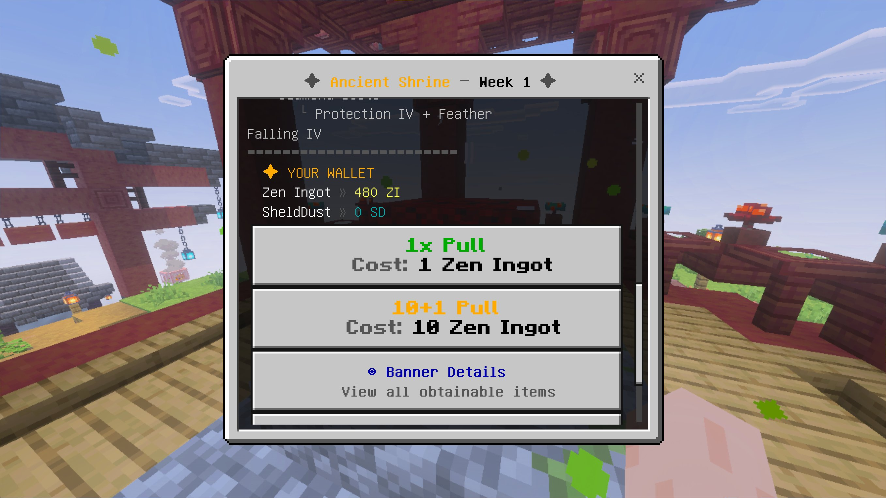
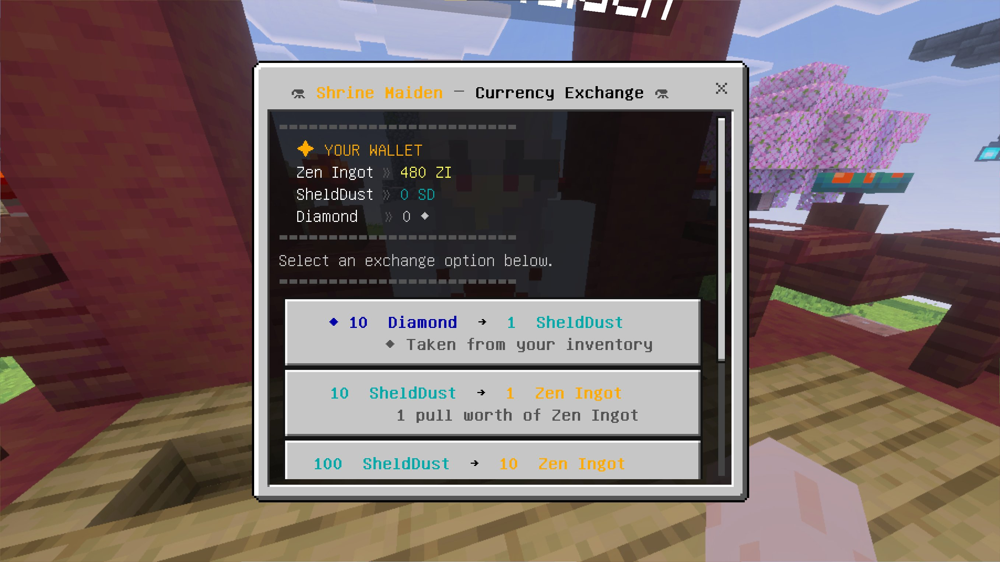
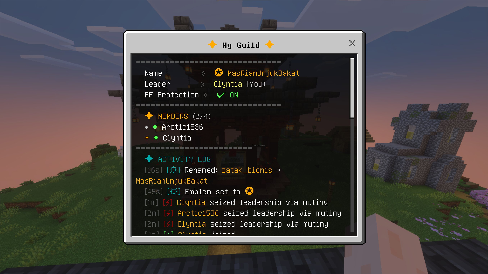
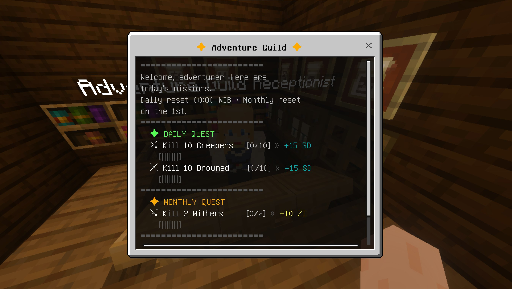
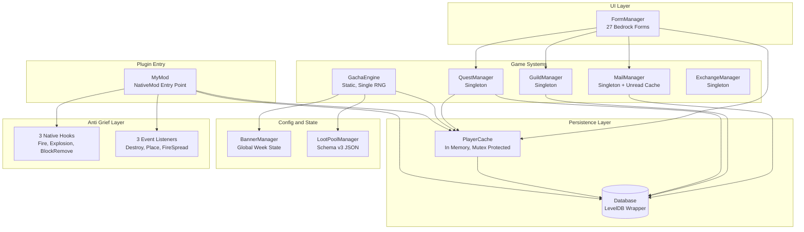

<div align="center">

# 🌌 Aetheria Server Mod

**A Minecraft Bedrock server plugin that adds Quest, Currency, Gacha, Guild, and Mail systems. Written in C++17 on the LeviLamina framework.**

[](https://en.cppreference.com/w/cpp/17)
[](https://github.com/LiteLDev/LeviLamina)
[](https://www.minecraft.net/en-us/download/server/bedrock)
[](https://xmake.io)
[](LICENSE)

</div>

---

## Table of Contents

- [What This Is](#what-this-is)
- [Features](#features)
- [Screenshots](#screenshots)
- [Architecture](#architecture)
- [Gacha Mathematics](#gacha-mathematics)
- [Installation](#installation)
- [Configuration](#configuration)
- [In Game Guide](#in-game-guide)
- [Commands](#commands)
- [Project Structure](#project-structure)
- [Database Schema](#database-schema)
- [Event Listeners and Native Hooks](#event-listeners-and-native-hooks)
- [Development](#development)
- [Roadmap](#roadmap)
- [Acknowledgments](#acknowledgments)
- [License](#license)

---

## What This Is

A server side C++ plugin that turns a vanilla Minecraft Bedrock server into a progression focused experience. Players earn currency from quests, exchange it at a shrine, and spend it on randomized rewards through a gacha system. They form guilds with up to four members, vote on leadership changes, and send each other in game mail that persists across login sessions.

Five systems run in parallel and share the same persistence layer. One LevelDB instance holds all data. One in memory cache keeps every online player's state at O(1) reach. The whole thing runs on the server with no client mod required.

Most Bedrock plugins do one thing. This one tries to do five and share infrastructure between them, which is the part that actually makes the architecture interesting.

---

## Features

### Gacha System
Three rarity tiers with mathematically sound rate distribution. The exponential pity curve guarantees a B5 by pull 70 and a B4 by pull 20. A 40/60 hidden rate adds the "lose your 50/50" tension familiar from Genshin Impact, plus a Dynamic Guarantee Window that gets you back to a banner item within 30 pulls of a loss. Pity counters for B5 and B4 run independently in parallel. Single RNG roll with Dynamic Priority Stacking ensures total probability always equals 100% even when rates overlap heavily.

### Quest System
Four quest tiers run from common to rare. Normal quests appear every day with a 100% chance. Advance quests roll at 35%, Special at 7%, and Monthly resets on the first of every month. Kill tracking has a TTL fallback so indirect kills from fire, drowning, or fall damage still credit the player who landed the last hit within 60 seconds. The quest pool lives in JSON so adding new objectives needs no recompile.

### Currency System
Three tier currency. Diamond converts to SheldDust at 10:1. SheldDust converts to Zen Ingot at 10:1. Zen Ingot buys gacha pulls. The exchange UI supports bulk multipliers of x1, x10, and x100 so you can convert 100 SheldDust into 10 Zen Ingots in one click instead of repeating the same form ten times.

### Guild System
Up to four members per guild with democratic governance built in. Two voting mechanisms cover the social edge cases. Kick Vote lets the leader remove a member with unanimous approval from the rest. Mutiny Vote lets any member challenge the leader if the leader goes inactive. Both cost 10 Zen Ingots and time out after one hour. Friendly fire protection works in three layers covering melee, projectiles, and splash potions. Guild emblems pick from twelve Unicode presets that render reliably in the default Bedrock font. Renaming a guild costs 15 Zen Ingots and has a 14 day cooldown to prevent name spam.

### Mail System
The inbox lives in LevelDB so it survives offline periods. Six mail types cover system notifications, guild invites, vote ballots, guild notices, and join requests. A V2 index format caches the unread count separately from the mail list, which avoids an N+1 query every time someone checks their inbox. The system enforces a soft cap of 100 mails per player via FIFO eviction and purges anything older than 30 days.

### World Structures and Anti Grief
The Adventure Guild building auto spawns at 100% rate in birch and forest villages. The Shrine auto spawns at 100% rate in cherry villages. Both buildings are protected by an anti grief system that runs at two layers. Three event listeners catch normal block destruction, placement, and fire spread. Three native function hooks catch the cases that do not have event API exposure, including explosions and the wither's body slam destruction.

### Bedrock UI
27 form screens cover every interaction including pull results, banner detail pages, the inbox, guild management, and quest progress.

---

## Screenshots

### Ancient Shrine Gacha Menu
The main pull interface. Shows the active banner week, your wallet balance, and the two pull options. Banner Details opens a separate form listing every obtainable item for the current week.



### Currency Exchange
Talk to the Shrine Maiden NPC to convert between Diamond, SheldDust, and Zen Ingot. Each exchange option is its own form button with a bulk multiplier shown inline.



### My Guild
The guild overview shows name, leader, member count, friendly fire toggle, and the activity log. The log keeps the last 20 entries with relative timestamps. Mutiny events show with a red lightning glyph so they stand out from regular admin actions.



### Adventure Guild Quest Menu
The quest receptionist NPC gives out daily and monthly quests. Each row shows the objective, current progress, and the SheldDust or Zen Ingot reward. The progress bar visualizes how close you are to the goal.



---

## Architecture

### High Level Component Diagram



### Component Responsibilities

| Component | Pattern | Responsibility |
|-----------|---------|----------------|
| `MyMod` | NativeMod entry | Plugin lifecycle, event registration, shrine and guild base registry |
| `Database` | Singleton | LevelDB wrapper with partial updates via `savePity()`, `saveCurrency()`, `saveQuests()` |
| `PlayerProfile` | Instance per player | In memory state. Wallet, pity, quest progress, welcome flag |
| `PlayerCache` | Thread safe Singleton | `unordered_map<xuid, unique_ptr<PlayerProfile>>` with `std::mutex` |
| `GachaEngine` | Static class | Single call `performPull()` for pity, rate, priority stack, roll, 40/60, reward |
| `BannerManager` | Singleton | Global current week state, persisted to `banner_state.json` |
| `LootPoolManager` | Singleton | Loads gacha pools. B5 and B4 Rate On per week, Standard pools, B3 pool |
| `QuestManager` | Singleton | Quest generation, kill tracker with TTL fallback, submission, auto reset |
| `GuildManager` | Singleton | Guild CRUD, voting, FF toggle, rename, emblem, activity log |
| `MailManager` | Singleton | Mail persistence with V2 index format and unread cache |
| `ExchangeManager` | Singleton | Currency conversion config with bulk multipliers |
| `FormManager` | Static aggregator | All 27 UI forms in a header only file |

---

## Gacha Mathematics

### B5 (Legendary) Exponential Pity Curve

For the first 40 pulls the rate stays flat at 0.6%. Starting from pull 41, the rate grows by:

```
Rate_B5(pity) = 0.006 + 0.994 × ((pity − 40) / 30)⁴
```

This hits exactly 100% at pull 70. The exponent of 4 keeps the curve relatively flat from pulls 41 to 55 and then ramps up sharply toward 70. The math creates the right tension without making the early soft pity feel too generous.

Implementation reference: [`src/mod/PlayerProfile.cpp::calcRateB5()`](src/mod/PlayerProfile.cpp)

```cpp
if (mPityB5 <= kSoftPityB5)  // kSoftPityB5 = 40
    return kRateB5Base;       // kRateB5Base = 0.006
double t = std::min(static_cast<double>(mPityB5 - kSoftPityB5) / 30.0, 1.0);
return std::min(kRateB5Base + 0.994 * std::pow(t, 4.0), 1.0);
```

### Dynamic Guarantee Window

When a player gets a B5 but loses the 40/60 hidden rate, the pity counter does not reset. The system records the `LossPity` value and switches to a dynamic guarantee formula:

```
Rate_B5(pity) = 0.006 + 0.994 × ((pity − LossPity) / 30)⁴
```

The math guarantees a Rate On B5 within 30 pulls of the loss no matter where the LossPity sat. If you lose at pull 50, you are guaranteed by pull 80. If you lose at pull 90 in a later cycle, you are guaranteed by pull 120.

### B4 (Epic) Sharper Curve

B4 uses a steeper exponent of 5 and a hard pity at 20:

```
Rate_B4(pity) = 0.051 + 0.949 × (pity / 20)⁵
```

The higher exponent keeps the rate near flat at 5.1% from pulls 0 to 15. Then it ramps hard from pull 16 to 20. B4 counters are independent of B5 counters and they do not reset each other.

### Dynamic Priority Single RNG

The tricky case is when both rates climb high near pity. If Rate_B5 is 93% and Rate_B4 is 80%, you cannot just add them because they exceed 100%. The engine picks a priority order based on which rate is higher and stacks the probability space accordingly:

```cpp
bool isB5First = (Rate_B5 >= Rate_B4);
if (isB5First) {
    eff5 = Rate_B5;
    eff4 = min(Rate_B4, max(0, 100 - Rate_B5));
    eff3 = max(0, 100 - eff5 - eff4);
} else {
    eff4 = Rate_B4;
    eff5 = min(Rate_B5, max(0, 100 - Rate_B4));
    eff3 = max(0, 100 - eff4 - eff5);
}
float roll = uniform_real_distribution<float>(0.0f, 100.0f)(rng);
```

One RNG call. Total probability always equals 100%. No way to double count or lose mass.

### Constants

| Constant | Value | Meaning |
|----------|-------|---------|
| `kRateB5Base` | `0.006` (0.6%) | Base B5 rate |
| `kSoftPityB5` | `40` | Pity threshold where the exponential growth starts for B5 |
| `kRateB4Base` | `0.051` (5.1%) | Base B4 rate |
| `kHardPityB4` | `20` | Hard pity for B4 |
| `kGuaranteeAdd` | `30` | Pulls added after a loss for the guarantee window |
| `kDiaToSD` | `10` | Diamond to SheldDust ratio |
| `kSDtoZI` | `10` | SheldDust to Zen Ingot ratio |

---

## Installation

### Prerequisites

- Minecraft Bedrock Dedicated Server v1.21.x on Windows
- LeviLamina installed on the BDS
- xmake build tool
- A C++17 capable compiler. MSVC 2022 works on Windows
- Git

### Build from Source

```bash
git clone https://github.com/<your-username>/aetheria-server-mod.git
cd aetheria-server-mod

xmake f -m release
xmake build

# Output: build/windows/x64/release/gacha_mod.dll
```

### Install the Compiled Plugin

Copy `gacha_mod.dll` to your BDS plugin folder:
```
<BDS-root>/plugins/gacha_mod/gacha_mod.dll
```

Create the data folder and drop the config files in:
```
<BDS-root>/plugins/gacha_mod/data/
    gacha_pool.json
    quest_config.json
```

The plugin auto generates `banner_state.json` and `exchange_config.json` on first run if they are missing.

For the custom NPCs you also need the behavior pack:
```
<BDS-root>/development_behavior_packs/aetheria_bp/
```

Start the server. You should see:
```
[GachaMod] Database OK: <path>
[GachaMod] Quest config OK.
[GachaMod] Exchange config OK: 4 options loaded.
[BannerManager] Banner aktif: Week 1 — Blade of Nether
GachaMod enabled.
```

---

## Configuration

Four JSON files in the plugin data directory control everything.

### `gacha_pool.json` (Schema v3)

Defines the loot pools for the four week banner rotation.

<details>
<summary><strong>Example item entry</strong></summary>

```json
{
  "item_id": "minecraft:netherite_sword",
  "name": "Netherite Sword [Sharpness X]",
  "display_name": "§6⚔ §lBlade of Aether §r§c[Sharpness X]",
  "count": 1,
  "weight": 1,
  "enchantments": [
    { "id": "minecraft:sharpness", "level": 10 }
  ]
}
```
</details>

Top level keys:
- `_schema_version`: Currently `3`
- `b5_rate_on`: `{week → [PoolItem]}` for B5 banner items
- `b4_rate_on`: `{week → [PoolItem]}` for B4 banner items
- `b5_standard`, `b4_standard`, `b3_pool`: Universal standard pools
- `banner_info`: Display info per week. Name, theme, featured item list

### `quest_config.json`

```json
{
  "normal_pool":  [ /* 9 quest definitions */ ],
  "advance_pool": [ /* 7 quest definitions */ ],
  "special_pool": [ /* 2 quest definitions */ ],
  "monthly_pool": [ /* 2 quest definitions */ ],
  "generation_rules": {
    "normal_count": 2,
    "advance_chance": 0.35,
    "special_chance": 0.07
  }
}
```

### `exchange_config.json`

Auto generated on first run. Edit it to add new conversion rates or bulk multipliers.

```json
{
  "exchanges": [
    { "id": "diamond_to_sd",  "from_currency": "diamond", "from_amount": 10, "to_currency": "sd", "to_amount": 1, "bulk_multiplier": 1 },
    { "id": "sd_to_zi_x10",   "from_currency": "sd",      "from_amount": 10, "to_currency": "zi", "to_amount": 1, "bulk_multiplier": 10 }
  ]
}
```

### `banner_state.json`

Managed by `BannerManager`. Stores the currently active banner week from 1 to 4. Change it via the `/gachaadmin setweek <n>` command.

```json
{
  "current_week": 1
}
```

---

## In Game Guide

### Player Quick Reference

| Action | How |
|--------|-----|
| Open Account menu | `/account` |
| Open Guild menu | `/guild` |
| Buy a Gacha pull | Visit the Shrine, talk to the Shrine Maiden, pick Gacha menu |
| Convert currency | Visit the Shrine, pick Currency Exchange |
| Accept a daily quest | Visit the Adventure Guild, left click the Receptionist NPC |
| Submit a collect quest | Open Quest Menu, select active Collect quest, click Submit |
| Check inbox | `/account` then Inbox |

### Currency Conversion

```
10 Diamond     →   1 SheldDust
10 SheldDust   →   1 Zen Ingot
 1 Zen Ingot   →   1 Gacha Pull
10 Zen Ingot   →   10 Pulls + 1 Free Bonus
```

### Quest Rewards

| Tier | Reward | Spawn Chance | Daily Limit |
|------|--------|--------------|-------------|
| ⭐ Normal | 15 SheldDust | 100% | 2 quests |
| ⭐⭐ Advance | 25 SheldDust | 35% | 1 quest max |
| ⭐⭐⭐ Special | 40 SheldDust | 7% | 1 quest max |
| 🌙 Monthly | 10 Zen Ingot | 100% | 1 per month |

### Gacha Rates

| Tier | Base Rate | Hard Pity | Mechanic |
|------|-----------|-----------|----------|
| ⭐⭐⭐⭐⭐ B5 | 0.6% | Pull 70 | 40/60 hidden + Dynamic Window |
| ⭐⭐⭐⭐ B4 | 5.1% | Pull 20 | 40/60 + Guaranteed next pull |
| ⭐⭐⭐ B3 | ~94% | none | Filler |

### Banner Rotation

| Week | Banner | Theme |
|------|--------|-------|
| 1 | **Blade of Nether** | Netherite Swords with enchantments |
| 2 | **Warden's Bastion** | Full Netherite Armor sets |
| 3 | **Hunter's Arsenal** | Bow, Crossbow, Trident |
| 4 | **Tool Grandmaster** | Netherite Tools and Fishing Rod |

---

## Commands

### Player Commands

| Command | Description |
|---------|-------------|
| `/account` | Open the Account window for wallet, pity status, and inbox |
| `/guild` | Open the Guild menu for create, request join, manage |

### Admin Commands

Require `GameDirectors` permission.

<details>
<summary><strong>Currency and Pity Management</strong></summary>

```
/gachaadmin add <xuid> <type> <amount>          # Add SD or ZI to a player
/gachaadmin pity_set <tier> <xuid> <value>      # Set pity counter manually
/gachaadmin pity_reset_global                   # Reset pity for all players. Use carefully
```
</details>

<details>
<summary><strong>Database Inspection</strong></summary>

```
/gachaadmin db_dump                             # Dump all keys for diagnostics
/gachaadmin db_reload                           # Reload config files without restart
/gachaadmin db_player_info <xuid>               # Inspect a specific player's data
```
</details>

<details>
<summary><strong>Structure Registration</strong></summary>

```
/gachaadmin register_altar                      # Register the block this command runs on as Shrine
/gachaadmin register_guildbase                  # Register as Adventure Guild base
/gachaadmin unregister_altar                    # Remove registration at current position
/gachaadmin unregister_guildbase
```

These are normally auto fired by hidden command blocks under the structures every 100 ticks.
</details>

<details>
<summary><strong>Banner and Loot Pool</strong></summary>

```
/gachaadmin setweek <1-4>                       # Manually change active banner week
/gachaadmin get all loot pool b5 week <n>       # List B5 Rate On items for a week
/gachaadmin get all loot pool b4 week <n>       # List B4 Rate On items
/gachaadmin get all loot pool b5 std            # B5 Standard pool
/gachaadmin get all loot pool b4 std            # B4 Standard pool
/gachaadmin get all loot pool b3                # B3 pool
```
</details>

<details>
<summary><strong>Gacha and Quest Debug</strong></summary>

```
/gachaadmin gacha start <xuid> <count>          # Force a gacha pull
/gachaadmin quest reset_daily                   # Reset all players' daily quests
/gachaadmin quest reset_monthly                 # Reset monthly quests
/gachaadmin quest list                          # Show all quest definitions
/gachaadmin quest kill <mob_id> <count>         # Simulate kills for testing
```
</details>

---

## Project Structure

```
aetheria-server-mod/
├── src/
│   └── mod/
│       ├── MyMod.cpp / MyMod.h              # Plugin entry, event registration
│       ├── Database.cpp / Database.h        # LevelDB wrapper with partial updates
│       ├── PlayerProfile.cpp / .h           # Per-player state + PlayerCache
│       ├── GachaEngine.cpp / .h             # Pull execution (static class)
│       ├── GachaTypes.h                     # Enums and structs (Tier, RateType, etc)
│       ├── BannerManager.cpp / .h           # Global banner week state
│       ├── LootPoolManager.cpp / .h         # Pool parsing and item selection
│       ├── QuestManager.cpp / .h            # Quest generation, kill tracker, reset
│       ├── QuestData.h
│       ├── GuildManager.cpp / .h            # Guild CRUD + voting (1192 lines)
│       ├── GuildData.h                      # GuildData, KickVote, MutinyVote, Mail
│       ├── MailManager.cpp / .h             # Mailbox persistence + unread cache
│       ├── ExchangeManager.cpp / .h         # Currency exchange config
│       ├── DebugCommand.cpp / .h            # Admin command registration
│       ├── FormManager.h                    # 27 Bedrock UI forms (header only)
│       ├── FireBurnHook.cpp                 # Native hook: prevent fire spread
│       ├── ExplosionHook.cpp                # Native hook: prevent block-breaking explosions
│       ├── BlockRemoveHook.cpp              # Native hook: catch wither destruction
│       ├── MemoryOperators.cpp              # Custom memory operators
│       ├── gacha_pool.json                  # Loot pool config (schema v3)
│       └── quest_config.json                # Quest pool definitions
├── docs/
│   └── screenshots/                         # In-game UI screenshots
├── xmake.lua                                # Build configuration
└── README.md
```

Source statistics:
- 34 files at around 540 KB total
- C++17 with modern features. `<format>`, structured bindings, `if constexpr`
- The only macro is `LL_AUTO_TYPE_INSTANCE_HOOK` for the native hooks

---

## Database Schema

Everything persistent lives in one LevelDB instance in the plugin data directory. The schema uses prefixed keys to separate domains. LevelDB stores keys in lexicographic order so prefix scans are efficient.

| Key Format | Value | Description |
|------------|-------|-------------|
| `player:{xuid}` | `PlayerData` JSON | Pity counters, wallet, quest progress, banner week |
| `guild:{guildId}` | `GuildData` JSON | Leader, members, log, FF protection, emblem |
| `guild_by_member:{xuid}` | `guildId` string | Reverse lookup. One player to one guild |
| `guild_kick:{guildId}` | `KickVote` JSON | Active kick vote, max one per guild |
| `guild_mutiny:{guildId}` | `MutinyVote` JSON | Active mutiny vote, max one per guild |
| `mail:{xuid}:{mailId}` | `MailMessage` JSON | Individual mail entry |
| `mail_index:{xuid}` | V2 Index JSON | Array of mailIds (newest first) plus unread count |

### Partial Update Methods

To keep I/O low, `Database` provides field specific update methods rather than rewriting the full `PlayerData` blob every time.

```cpp
db.savePity(xuid, pityB5, guaranteeWindowB5, guaranteedFlagB5, pityB4, guaranteedFlagB4);
db.saveCurrency(xuid, sheldDust, zenIngot);
db.saveQuests(xuid, dailyJson, monthlyJson, lastReset, lastMonthlyReset);
```

These get called from `PlayerProfile::flushPity()`, `flushCurrency()`, and after quest mutations. No full struct re serialization on every minor state change.

---

## Event Listeners and Native Hooks

### Event Listeners

11 listeners registered in `MyMod::enable()` against `ll::event::EventBus`.

| Event | Purpose |
|-------|---------|
| `PlayerJoinEvent` | Hybrid sync and deferred profile load. Welcome popup. Unread mail badge |
| `PlayerDisconnectEvent` | Flush profile to DB. Update guild last seen |
| `ServerLevelTickEvent` | Vote expiry. Mail purge. Batched last seen flush |
| `PlayerDestroyBlockEvent` | Anti grief for block destruction in protected zones |
| `PlayerPlacingBlockEvent` | Anti grief for block placement |
| `FireSpreadEvent` | Anti grief for fire spread |
| `PlayerInteractBlockEvent` | Form UI trigger from special command blocks |
| `PlayerAttackEvent` | FF protection for melee and NPC Receptionist left click |
| `ActorHurtEvent` | FF protection for projectiles with shooter resolution |
| `MobDieEvent` | Quest kill tracking and hit tracker fallback |
| `PlayerChatEvent` | Guild prefix injection like `§6[♛ Aetheria]` |

### Native Function Hooks

Three native hooks for cases the event bus does not expose.

| Hook File | Target Function | Purpose |
|-----------|-----------------|---------|
| `FireBurnHook.cpp` | `FireBlock::checkBurn()` | Stop fire from eating flammable blocks inside protected zones |
| `ExplosionHook.cpp` | `Explosion::explode()` | Set `mBreaking = false` when an explosion overlaps a protected bounding box |
| `BlockRemoveHook.cpp` | `BlockSource::removeBlock()` | Catch wither body slam destruction. Let transient blocks like fire, snow, and water dissipate naturally |

---

## Development

### Coding Conventions

- Namespace: everything lives in `gacha_mod::`
- File naming: `PascalCase` for C++ files like `GachaEngine.cpp`
- Class members: `m` prefix for private members like `mPityB5`
- Constants: `k` prefix in `camelCase` constexpr like `kSoftPityB5`
- Indentation: 4 spaces, no tabs
- Comments: Indonesian or English. Prefer English for public API docs

### Threading Model

Most plugin code runs on the server's main game thread. The places where mutex protection matters:

- `PlayerCache` gets accessed from chat callbacks, form callbacks, and the game thread. Protected by `std::mutex mMutex`
- `MailManager` unread cache has its own `std::mutex mUnreadMu`
- RNG generators use `thread_local std::mt19937` per thread to avoid contention

### Adding a New Quest Type

Edit `quest_config.json`. Add the entry to the appropriate pool:
```json
{ "id": "kill_phantom_5", "type": "Advance", "category": "Kill",
  "target_id": "minecraft:phantom", "target": 5, "reward_sd": 25,
  "display": "Kill 5 Phantoms" }
```

Restart the server or run `/gachaadmin db_reload`. The new quest will show up in random rotations.

### Adding a New Gacha Item

Edit `gacha_pool.json` and add to the appropriate pool array. Increment `weight` for items that should appear more often. Restart or reload.

### Building and Debugging

```bash
# Debug build with symbols
xmake f -m debug
xmake build

# Static analysis if clang-tidy is configured
xmake check clang.tidy

# Generate compile_commands.json for clangd
xmake project -k compile_commands
```

---

## Roadmap

### Done
- Core gacha engine with exponential pity
- Quest system with four tiers and kill tracker fallback
- Currency system with bulk multipliers
- Guild system with vote, FF, rename, emblem
- Mail system with V2 index
- Anti grief at event and native hook layers
- 27 Bedrock UI forms
- Admin debug commands

### Planned
- Per player banner history. Track which banner items have already been obtained
- Multi language support
- Seasonal events with limited time banners
- Leaderboards. Richest player, best gacha luck
- Discord webhook integration
- Web admin panel, read only

---

## Acknowledgments

### Inspiration and References

- [Genshin Impact](https://genshin.hoyoverse.com/) for the pity system and 50/50 hidden rate mechanic
- [allemandi/gacha-engine](https://github.com/allemandi/gacha-engine) as a reference implementation for gacha mechanics
- [nalin-adhikari's Gist](https://gist.github.com/nalin-adhikari/d0f521e28051ba838b4e652b6959c05a) for the pity curve mathematical reference

### Technical Stack

- [LeviLamina](https://github.com/LiteLDev/LeviLamina). C++ plugin framework for Minecraft Bedrock
- [LevelDB](https://github.com/google/leveldb). Embedded key value store from Google
- [nlohmann/json](https://github.com/nlohmann/json). JSON for Modern C++
- [xmake](https://xmake.io). Lua based cross platform build tool

### Mathematical References

- Chen, C., Qin, H., Xu, Z., and Li, B. (2023). *Gacha Game Analysis and Design*. ACM Proceedings.
- Gan, T. (2023). *Gacha Game: When Prospect Theory Meets Optimal Pricing*. arXiv:2208.03602.
- Nadkarni, V. (2025). *A Mathematical Analysis of Persona 5: The Phantom X's Gacha System*. Tom Rocks Maths.
- Matsumoto, M., and Nishimura, T. (1998). *Mersenne Twister: A 623-dimensionally Equidistributed Uniform Pseudo-random Number Generator*. ACM TOMS.

---

## License

MIT License. See [LICENSE](LICENSE) for details.

```
MIT License

Copyright (c) 2025 Aetheria Server Mod Contributors

Permission is hereby granted, free of charge, to any person obtaining a copy
of this software and associated documentation files (the "Software"), to deal
in the Software without restriction, including without limitation the rights
to use, copy, modify, merge, publish, distribute, sublicense, and/or sell
copies of the Software, and to permit persons to whom the Software is
furnished to do so, subject to the following conditions:

The above copyright notice and this permission notice shall be included in all
copies or substantial portions of the Software.

THE SOFTWARE IS PROVIDED "AS IS", WITHOUT WARRANTY OF ANY KIND.
```

---

<div align="center">

**[Back to Top](#-aetheria-server-mod)**

</div>
